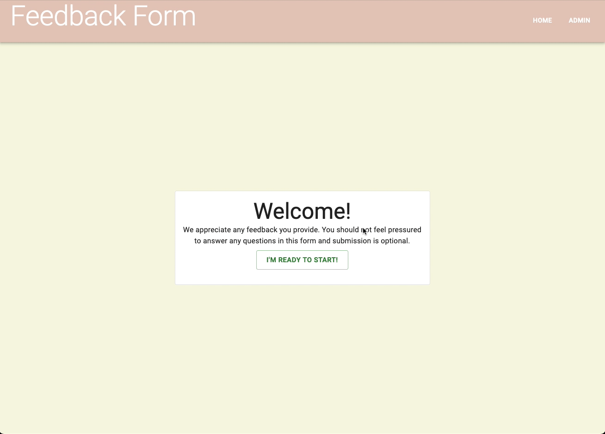

# Redux Feedback Form:

## Description

_Duration: 12 hour Sprint_

Over the course of a weekend, the goal was to create a functional full-stack web based application. The web based application allow users to submit feedback.

[Webapp Link](https://whispering-hollows-86520-60601a085966.herokuapp.com/#/)

## Screen Shots
GIF showing application features:

## Description & Approach

In order to better understand where each path should lead to, I created a flow chart of how each path is interconnected. This allowed me to keep organized as I was aware of what each component should be doing.

### Prerequisites
- [Node.js](https://nodejs.org/en/)
- [React.js](https://react.dev/)
- [Redux.js](https://redux.js.org)
- Express 
- Body-Parser
- 'PG'
- Database Manager

## Installation
1. Clone this repository for your own access.
2. Open up your editor of choice and run `npm install`
3. Using your preferred database manager. Use the provided SQL file to set up the database as well as insert dummy data if needed.
4. Run `npm run server`  and `npm run client` in two different terminals.
5. Navigate to http://localhost3000/

## Usage
This web application is meant to create an interactive feedback form where users can submit their feedback, or go back to any previous pages:
 1. The user answers each question on the feedback form by selecting their choice and then selecting next.
 2. Using the go back button, users can go back and change their choices.
 3. Once the feedback form is submitted, the data is sent to the database
 4. Admins can look at the admin tab to see all the feedback sent. Additionally, they can delete any feedback or flag any for review.

## Acknowledgement
Thanks to [Prime Digital Academy](www.primeacademy.io) who equipped and helped me to make this application a reality.

## Support
If you have suggestions or issues, please email me at [paulhoanglong@gmail.com](www.google.com)
